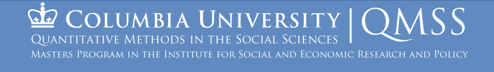

### 👋 Hi There

My name is Zeyu(Sisi) Dong. I am a graduate student learning Quantitative Methods in the Social Sciences (Data Science Track) at Columbia University and I graduate in May 2024. With 1 year experience of data analysis in different industries like consulting, technology, media, real estate investment, and academia, I have a broad understanding of how to tell a story through data and find patterns through modeling. In addition, I am passionate about organizing data for more insights.

### 🌱 What Can I Offer
  
* Exploratory Data Analysis
  
  
  

* Database Design and Data Warehousing
  
  
  
  
  
* Data Visualization
  
  
  

* Probability and Statistics
  
  
  
* Machine Learning

  
  
  
  
  
  
  
  
  
  
  
* Big Data
  
  
  

### 📫 How To Reach Me

I’m actively looking for a 2024 Full Time position in DS/DA. Welcome to reach me through Email (zd2326@columbia.edu) or LinkedIn ([Zeyu(Sisi) Dong](https://www.linkedin.com/in/zeyu-sisi-dong-b7ab5b26b))

